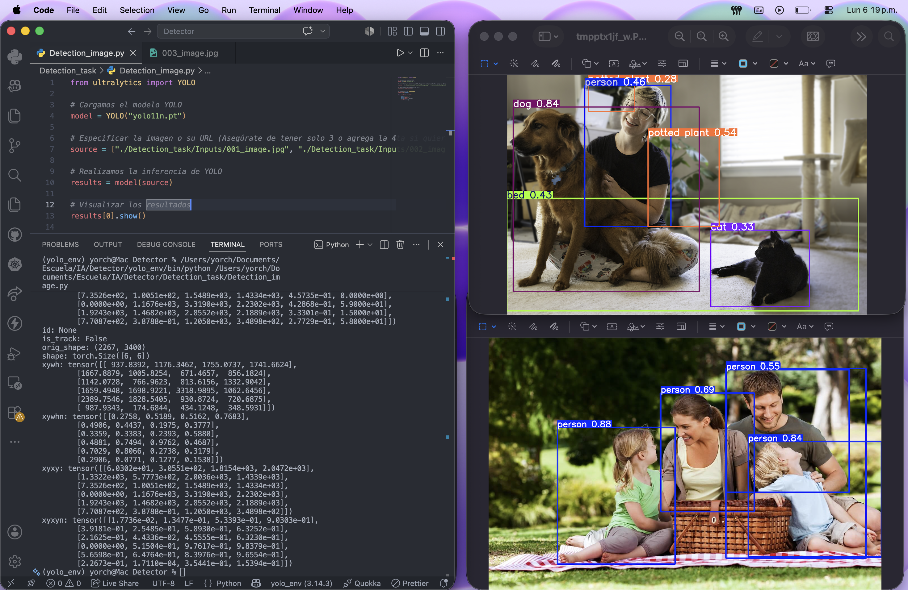

# Detector de Objetos

Descripción
---------
Proyecto simple para detección de objetos usando un modelo YOLO (archivo `yolo11n.pt`). El repositorio contiene un script de ejemplo para ejecutar la detección sobre imágenes y una imagen de evidencia en `assets/image.png`.

Estructura relevante
--------------------
- `yolo11n.pt` — modelo entrenado (debe estar en la raíz del proyecto).
- `Detection_task/Detection_image.py` — script de ejemplo para ejecutar la detección.
- `assets/image.png` — imagen mostrada como evidencia en este README.
- `yolo_env/` — entorno virtual incluido (opcionalmente activar).

Requisitos
----------
- Python 3.8+ (el proyecto incluye un env en `yolo_env` con Python 3.14).
- Paquetes habituales: `ultralytics`, `opencv-python`, `torch`, `numpy`, `Pillow`.

Instalación (opcional)
----------------------
Si usas el entorno virtual provisto:

```bash
source yolo_env/bin/activate
```

Si no tienes un `requirements.txt`, instala los paquetes mínimos:

```bash
pip install ultralytics opencv-python torch numpy pillow
```

Cómo ejecutar
--------------
Opción A — usar el script incluido:

```bash
# Desde la raíz del proyecto, con el entorno activado
python Detection_task/Detection_image.py
```

Opción B — usar la utilidad `yolo` (si está disponible en el entorno):

```bash
# Detecta sobre la imagen de evidencia
yolo detect predict model=yolo11n.pt source=assets/image.png
```

Notas
-----
- Asegúrate de que `yolo11n.pt` esté en la raíz del proyecto o ajusta la ruta en los comandos.
- Si el script `Detection_image.py` acepta argumentos (ruta de imagen, salida, etc.), puedes pasarlos directamente; revisa el encabezado del script para detalles.

Evidencia
---------
La siguiente imagen muestra una ejecución de ejemplo (resultado / evidencia) del proyecto:



Salida esperada
---------------
- El script puede guardar imágenes resultantes en una carpeta `runs/predict` (comportamiento típico de `ultralytics`), o imprimir cajas y clases por consola.

Contacto
-------
Si necesitas que adapte el README (añada instrucciones concretas sobre argumentos del script o un `requirements.txt`), dime y lo incluyo.
